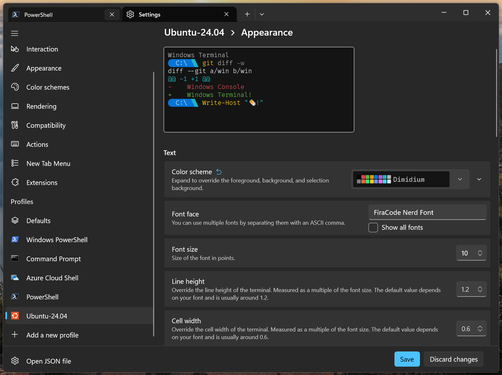

# Bash Tools

*Enhance your experience with few Bash Tools*

Before deep dive into Bash Shell, let's install few plugins for the Bash Shell so you will get auto completion, suggestions, proper history and similar things those are available in modern Shells such as Fish or zSh. It will also give you a glimpse of how things happen in Linux.

We will install and configure following packages:
- [ble.sh](https://github.com/akinomyoga/ble.sh) : Syntax highlighting and autosuggestions
- [Starship](https://starship.rs/) : Customize Prompt
- [fzf](https://junegunn.github.io/fzf/) : Filter program for any kind of list; files, command history, processes, hostnames, bookmarks, git commits, etc.

### PreRequisites

I have attached the screenshot where you may find relative settings.



- Install a Nerd-based font and apply it to the editor to get the best results.
- Set the color scheme as `Dimidium`.

### Phase 1: Install Packages

Execute this sequence to install required dependencies and core binaries.

```bash
# 1. Update system registries and install core build dependencies.
sudo apt update && sudo apt install git curl make gawk -y

# 2. Deploy ble.sh to engineer syntax highlighting and predictive autosuggestions.
git clone --recursive --depth 1 --shallow-submodules https://github.com/akinomyoga/ble.sh.git
make -C ble.sh install PREFIX=~/.local

# 3. Deploy the Starship binary to calibrate the visual prompt interface.
curl -sS https://starship.rs/install.sh | sh

# 4. Deploy the fzf tool to index search paths and command history.
sudo apt install fzf -y

```

### Phase 2: Configuration

The shell configuration requires strict execution ordering. Modifying this sequence will cause process failures.

Open your configuration file in any editor you are comfortable.

```bash
vim ~/.bashrc
# or
nano ~/.bashrc
# or even
notepad.exe ~/.bashrc
😮 # I can open a linux file inside NotePad! - YES.
# It's the power of wsl.
```

Insert this initialization hook at the absolute **top** of the file. It must load before any other interactive shell process.

```bash
# Initial ble.sh hook. Must remain at line 1.
[[ $- == *i* ]] && source ~/.local/share/blesh/ble.sh --noattach

```

Insert this integration block at the absolute **bottom** of the file. Maintain this exact order.

```bash
# 1. Bind fzf functions (Configured for legacy Ubuntu APT structures).
if [ -f /usr/share/doc/fzf/examples/key-bindings.bash ]; then
  source /usr/share/doc/fzf/examples/key-bindings.bash
fi
if [ -f /usr/share/doc/fzf/examples/completion.bash ]; then
  source /usr/share/doc/fzf/examples/completion.bash
fi

# 2. Initialize the Starship prompt infrastructure.
eval "$(starship init bash)"

# 3. Finalize ble.sh attachment. This must be the final process.
[[ ${BLE_VERSION-} ]] && ble-attach

```

Save and exit the file. Apply the configuration to the current session.

```bash
source ~/.bashrc

# Or Reboot the Linux, if you want 100% surety.
sudo reboot
```

### Phase 3: Confirmation

Let's check whether everything installed and configured properly.

Execute these diagnostic commands to verify the integrity of the installation.

**Audit Starship:**

```bash
starship --version
```

*Expected Result:* The terminal will output the installed Starship version number. The prompt line will already display modern glyphs utilizing your installed Nerd Font.

**Audit fzf:**

```bash
fzf --version
```

*Expected Result:* The terminal will output the active fzf version. Validate the integration by pressing `Ctrl + R`. A structured reverse-search interface will immediately populate the screen.

**Audit ble.sh:**

```bash
echo $BLE_VERSION
```

*Expected Result:* The terminal will output the software version number. Validate the engine by typing the first few letters of a previously executed command. The shell will display predictive grey text ahead of your cursor.

---

**Congratulations!**

You have successfully modernize the Bash Shell. 🎉
