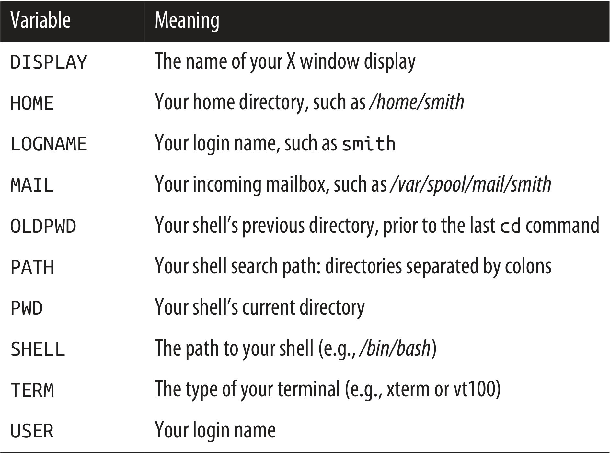

## Environment Variables

A variable that is accessible by subprocess (we will come on it later in detail) or even other instances of the shell is called an environment variable. We will see here how to create it and its use cases.

### Set and Get a variable

```bash
# declare and assign a variable
MYVAR=3

# Accessing a variable
echo $MYVAR
# 3

# make available a variable to all subprocesses
# exported variable is now called environment Variable.
export MYVAR # or
export MYVAR=51

# We can confirm it
printenv MYVAR
# 51
```

To make a variable available to every new shell you run not just subprocess of the current shell, place it int the **shell configuration file** such as `~/.bashrc`.

### Standard Variables

The shell defines some standard variables when you log in:




### Practical Usecases

Add current directory into `PATH` variable.

```bash
# current value
echo $PATH
# /run/user/1000/fnm_multishells/537_1780468882766/bin:/home/bhanubais/.local/share/fnm:/usr/local/sbin:/usr/local/bin:/usr/sbin:/usr/bin:/sbin:/bin:/usr/games:/usr/local/games:/usr/lib/wsl/lib:/mnt/c/Program Files/Common Files/Oracle/Java/javapath:/mnt/c/Program Files/ImageMagick-7.1.2-Q16-HDRI:/mnt/c/Program Files (x86)/Common Files/Intel/Shared Files/cpp/bin/Intel64:/mnt/c/WINDOWS/system32:/mnt/c/WINDOWS:/mnt/c/WINDOWS/System32/Wbem:/mnt/c/WINDOWS/System32/WindowsPowerShell/v1.0/:/mnt/c/WINDOWS/System32/OpenSSH/:/mnt/c/Program Files/Git/cmd:/mnt/c/Users/bhanu/AppData/Local/Python/pythoncore-3.14-64/Scripts:/mnt/c/Program Files/Docker/Docker/resources/bin:/mnt/c/Program Files/Amazon/AWSCLIV2/:/mnt/c/Program Files/NVIDIA Corporation/NVIDIA App/NvDLISR:/mnt/c/Program Files (x86)/NVIDIA Corporation/PhysX/Common:/mnt/c/Program Files/PowerShell/7/:/mnt/c/Users/bhanu/.local/bin:/mnt/c/Users/bhanu/AppData/Local/Microsoft/WindowsApps:/mnt/c/Users/bhanu/AppData/Local/Microsoft/WinGet/Packages/Schniz.fnm_Microsoft.Winget.Source_8wekyb3d8bbwe:/mnt/c/Users/bhanu/AppData/Local/Python/bin:/mnt/c/Program Files/Sublime Text:/mnt/c/Users/bhanu/.bun/bin:/mnt/i/run_from_here/php:/mnt/c/Users/bhanu/AppData/Local/Programs/Microsoft VS Code/bin:/mnt/i/run_from_here/sqlite3:/mnt/c/Users/bhanu/AppData/Local/Microsoft/WinGet/Packages/direnv.direnv_Microsoft.Winget.Source_8wekyb3d8bbwe:/mnt/c/Users/bhanu/AppData/Local/Microsoft/WinGet/Packages/GitHub.Copilot_Microsoft.Winget.Source_8wekyb3d8bbwe:/mnt/c/Users/bhanu/AppData/Local/PowerToys/DSCModules/:/mnt/c/Users/bhanu/AppData/Local/Microsoft/WinGet/Packages/astral-sh.uv_Microsoft.Winget.Source_8wekyb3d8bbwe:/mnt/c/Users/bhanu/AppData/Local/Programs/codecrafters:/snap/bin

# Current Location
pwd
# /home/bhanubais/linuxpocketguide

# Add current directory into PATH variable
export PATH="$(pwd):$PATH"

echo $PATH
# /home/bhanubais/linuxpocketguide:/run/user/1000/fnm_multishells/537_1780468882766/bin:/home/bhanubais/.local/share/fnm:/usr/local/sbin:/usr/local/bin:/usr/sbin:/usr/bin:/sbin:/bin:/usr/games:/usr/local/games:/usr/lib/wsl/lib:/mnt/c/Program Files/Common Files/Oracle/Java/javapath:/mnt/c/Program Files/ImageMagick-7.1.2-Q16-HDRI:/mnt/c/Program Files (x86)/Common Files/Intel/Shared Files/cpp/bin/Intel64:/mnt/c/WINDOWS/system32:/mnt/c/WINDOWS:/mnt/c/WINDOWS/System32/Wbem:/mnt/c/WINDOWS/System32/WindowsPowerShell/v1.0/:/mnt/c/WINDOWS/System32/OpenSSH/:/mnt/c/Program Files/Git/cmd:/mnt/c/Users/bhanu/AppData/Local/Python/pythoncore-3.14-64/Scripts:/mnt/c/Program Files/Docker/Docker/resources/bin:/mnt/c/Program Files/Amazon/AWSCLIV2/:/mnt/c/Program Files/NVIDIA Corporation/NVIDIA App/NvDLISR:/mnt/c/Program Files (x86)/NVIDIA Corporation/PhysX/Common:/mnt/c/Program Files/PowerShell/7/:/mnt/c/Users/bhanu/.local/bin:/mnt/c/Users/bhanu/AppData/Local/Microsoft/WindowsApps:/mnt/c/Users/bhanu/AppData/Local/Microsoft/WinGet/Packages/Schniz.fnm_Microsoft.Winget.Source_8wekyb3d8bbwe:/mnt/c/Users/bhanu/AppData/Local/Python/bin:/mnt/c/Program Files/Sublime Text:/mnt/c/Users/bhanu/.bun/bin:/mnt/i/run_from_here/php:/mnt/c/Users/bhanu/AppData/Local/Programs/Microsoft VS Code/bin:/mnt/i/run_from_here/sqlite3:/mnt/c/Users/bhanu/AppData/Local/Microsoft/WinGet/Packages/direnv.direnv_Microsoft.Winget.Source_8wekyb3d8bbwe:/mnt/c/Users/bhanu/AppData/Local/Microsoft/WinGet/Packages/GitHub.Copilot_Microsoft.Winget.Source_8wekyb3d8bbwe:/mnt/c/Users/bhanu/AppData/Local/PowerToys/DSCModules/:/mnt/c/Users/bhanu/AppData/Local/Microsoft/WinGet/Packages/astral-sh.uv_Microsoft.Winget.Source_8wekyb3d8bbwe:/mnt/c/Users/bhanu/AppData/Local/Programs/codecrafters:/snap/bin

```


## Aliases

The `alias` command defines a convenient shorthand for another command.

```bash
# list all alias
alias
# alias alert='notify-send --urgency=low -i "$([ $? = 0 ] && echo terminal || echo error)" "$(history|tail -n1|sed -e '\''s/^\s*[0-9]\+\s*//;s/[;&|]\s*alert$//'\'')"'
# alias egrep='egrep --color=auto'
# alias fgrep='fgrep --color=auto'
# alias grep='grep --color=auto'
# alias l='ls -CF'
# alias la='ls -A'
# alias ll='ls -alF'
# alias ls='ls --color=auto'
# alias vi='nvim'
# alias vim='nvim'

# Create an alias
alias ll='ls -lG'
# Now we can use `ll` instead of `ls -lG`.

# Important usecases: Every beginner in Linux should make this alias.
alias rm='rm -i'
# Now it will ask your confirmation for each file/folder to delete.
```

If you want to make an alias or future use, store it in Bash configuration file such as `~/bashrc`.
