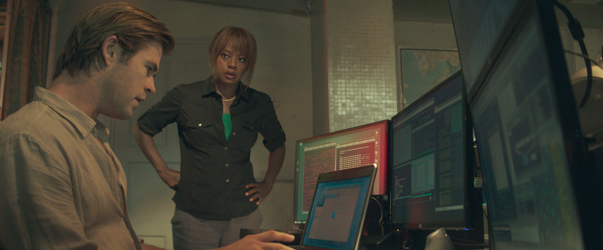
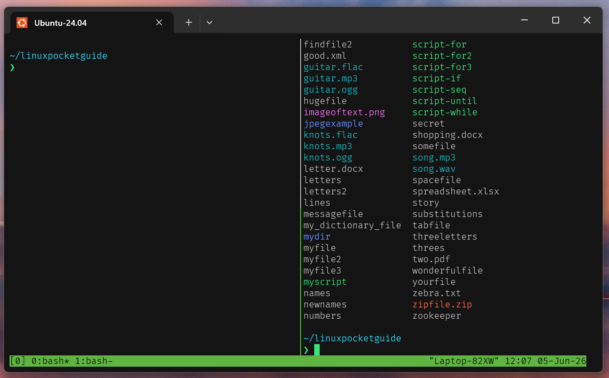
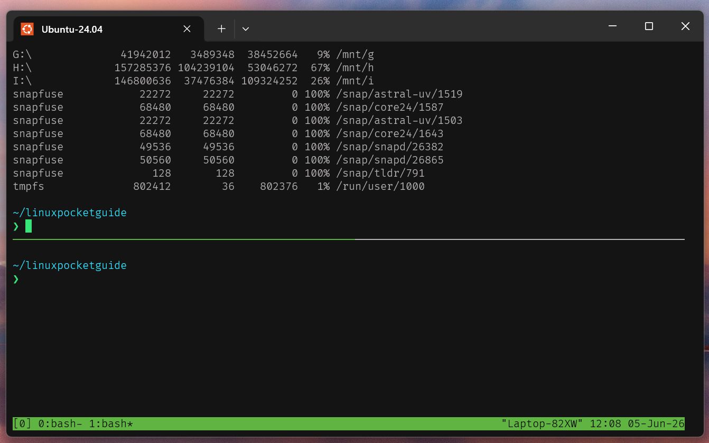

# Run multiple Shells at once



Have you ever watched Hollywood movies about hacking and wondered if you could do the same to impress our colleagues by splitting your terminal on multiple screens? Now you don’t have to imagine it. In this doc you will know how you can actually do it and have control on it.

We will use `tmux` program to achieve this.

## Tmux

When we run `tmux` command first time. It will open a windows. There are multiple things mentioned below

- **Windows:** 0 to 9, Total 10
  + **Panes:** Each window may has multiple Panes
  + Each Pane has its own Shell (descended from Main upper window)
  + Multiple screens at a time are actually multiple Panes.
  + When we split a windows, we actually create a new Pane.
- Two different windows may have different internal layout using their own Panes.

### Regular Shortkeys

```bash
# Run Tmux first time
tmux
# It open a new Tmux Window i.e. 0

# Create a new Window
^Bc: Ctrl-B, then press c
# It open a new Tmux Window i.e. 1

# Switch between windows
^Bn: Ctrl-B, then press n

# Switch directly on a particular window
^B0, ^B1, ^B2, ... ^B9

# Split a Window to right-side
^B%: Ctrl-B, then press %

# Split a window to bottom-side
^B": Ctrl-B, then press "

# Switch between Panes
^Bo: Ctrl-B, then press o
```

### Demonstration

Note the status bar when you change the windows. There is a `*` in front of windows number to highlight active window.

**Window-0**


```txt
tmux  # New Window (first time)
^B%   # split to left

ls
```

**Window-1**


```txt
# Continuous from previous
^Bc   # New Window
^B"   # Split to bottom
^Bo   # Switch Pane to top

ls
```

### Other Shortkeys

| Keystroke | Meaning |
|---|---|
| ^B? | Display online help. Press `q` to quit. |
| ^Bc | Create a window. |
| ^B0, ^B1 … ^B9 | Switch to window 0 through 9, respectively. |
| ^Bn | Switch to the next window, numerically. |
| ^Bp | Switch to the previous window, numerically. |
| ^Bl | Switch to the most recently used window. |
| ^B% | Split into two panes side by side. |
| ^B" | Split into two panes top and bottom. |
| ^Bo | Jump to the next pane. |
| ^B left arrow | Jump to the pane to the left. |
| ^B right arrow | Jump to the pane to the right. |
| ^B up arrow | Jump to the pane above. |
| ^B down arrow | Jump to the pane below. |
| ^Bq | Display pane numbers for reference. |
| ^Bx | Kill the current pane. |
| ^B^B | Send a true `Ctrl-B` to your shell, ignored by `tmux`. |
| ^B^Z | Suspend `tmux`. |
| ^Bd | **Detach** from a `tmux` session and return to your original shell. To return to `tmux`, run `tmux attach`.|
| ^D | Terminate a shell in a window or pane. This is the ordinary “end of file” keystroke, which closes any shell.
| ^B:kill-session | Kill all windows and terminate tmux. |
