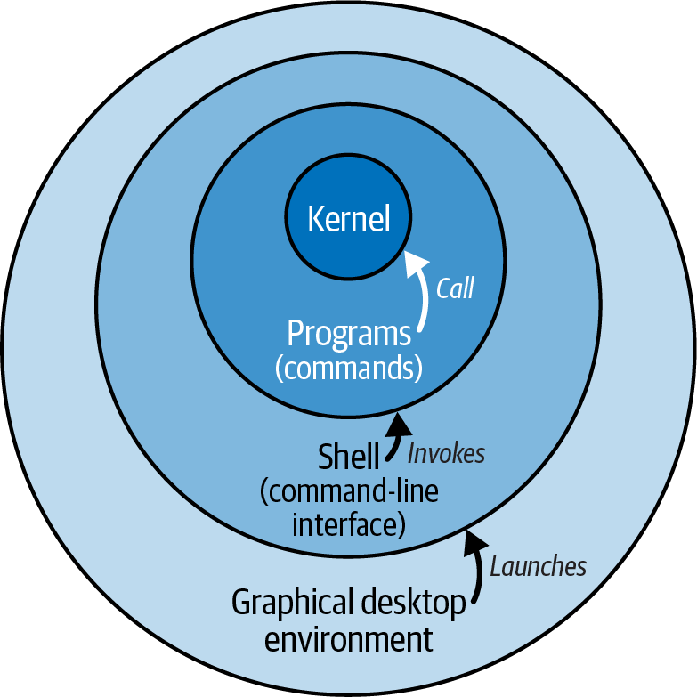

# The Linux Filesystem

You have transitioned from Windows to Linux. The operational phase begins now. Take your coffee; let's get started. ☕

The Linux operating system functions through four primary layers. Low-level kernel routines interact directly with hardware. User-space programs call these kernel functions. Shells invoke these programs. Graphical desktop environments provide a visual interface to manage shells and programs.

1. **Kernel**: The core interface between software and hardware resources (CPU, memory, devices).
2. **Programs**: Executable binaries. When executed via a terminal, these are commonly referred to as commands.
3. **Shell**: The command-line interpreter (e.g., `bash`, `zsh`, `dash`). It translates user input into system actions.
4. **Graphical Desktop Environment**: The visual interface (e.g., GNOME, KDE) running on a display server. This layer is optional.



## Shell Operation Lifecycle

The shell processes commands through a specific sequential pipeline.

1. **Read**: Accepts input from a file or terminal session.
2. **Tokenize**: Breaks input into words and operators using metacharacters.
3. **Parse**: Structures tokens into executable commands.
4. **Expand**: Translates wildcards and variables into explicit filenames and arguments.
5. **Redirect**: Processes input/output routing directives and removes operators from the argument list.
6. **Execute**: Runs the specified binary or built-in command.
7. **Wait**: Pauses for process completion to collect the exit status.

## System Directories

The Filesystem Hierarchy Standard dictates directory structure. It is organized by scope and category.


### Scope Hierarchy

| Scope | Path | Purpose |
| :--- | :--- | :--- |
| **Root** | `/` | Core system files necessary for boot and basic operation. |
| **Distribution** | `/usr` | Read-only user data and programs supplied by the package manager. |
| **Local** | `/usr/local` | Software compiled and installed manually by the system administrator. |

### Standard Categories

**Programs:**
- **`bin`**: Standard executable binaries available to all users.
- **`sbin`**: System binaries requiring root privileges.
- **`lib`**: Shared libraries required by the executable binaries.

**Documentations:**
- **`doc`**: General software documentation.
- **`info`**: GNU Info system documentation files.
- **`man`**: System manual pages.
- **`share`**: Architecture-independent data, including examples and shared resources.

**Configurations:**
- **`etc`**: Host-specific system configuration files.
- **`init.d`**: Legacy SysVinit scripts for managing system services.
- **`rc.d`**: Runlevel configurations for system boot states.

**Programming:**
- **`include`**: Standard C and C++ header files for compilation.
- **`src`**: Source code for installed software.

**Web files:**
- **`cgi-bin`**: Executable scripts and programs for web servers.
- **`html`**: Static web pages and assets.
- **`public_html`**: User-specific root directories for web content.
- **`www`**: Default document root for web servers.

**Display:**
- **`fonts`**: System-wide installed fonts.
- **`X11`**: Configuration files for the X Window System.

**Hardware:**
- **`dev`**: Device nodes representing physical or virtual hardware.
- **`media`**: Mount points for removable storage like USB drives.
- **`mnt`**: Temporary mount points for external filesystems.

**Running files:**
- **`var`**: Variable data files including caches and system states.
- **`lock`**: Lock files used to prevent concurrent execution of a process.
- **`log`**: System and application event logs.
- **`mail`**: User mailboxes for incoming messages.
- **`run`**: Runtime data tracking active processes and PIDs since the last boot.
- **`spool`**: Queued files for deferred tasks like printing or cron jobs.
- **`tmp`**: Temporary file storage that clears upon system reboot.


### The Usr-Merge Concept

Consider the `hostnamectl` command:

```bash
which hostnamectl
/usr/bin/hostnamectl

# Scope = /usr
# Category = Program (bin)
# Program name = hostnamectl
```

Most modern Linux distributions implement the `usr-merge`. Foundational binaries historically located in `/bin` are now consolidated into `/usr/bin`. The root `/bin` directory acts as a symbolic link to ensure backward compatibility.

```bash
❯ ls -ld /bin
lrwxrwxrwx 1 root root 7 Apr 22  2024 /bin -> usr/bin
```

## Virtual Filesystems: `/proc` and `/sys`

These directories do not contain standard files stored on a disk. They are pseudo-filesystems generated in memory by the kernel.

* **`/boot`**: Static files required to boot the system (kernels, initramfs).
* **`/proc`**: Process information pseudo-filesystem. It exposes internal kernel data structures.
* **`/sys`**: Sysfs virtual filesystem. It exports information about devices and drivers.

Files in `/proc` and `/sys` frequently display a size of zero and current timestamps. Reading them dynamically queries the kernel.

```bash
stat /proc/version
#   File: /proc/version
#   Size: 0             Blocks: 0          IO Block: 1024   regular empty file
# Device: 0,59    Inode: 4026532027  Links: 1
# Access: (0444/-r--r--r--)  Uid: (    0/    root)   Gid: (    0/    root)
# Access: 2026-06-03 08:18:14.890770800 +0530
# Modify: 2026-06-03 08:18:14.890770800 +0530
# Change: 2026-06-03 08:18:14.890770800 +0530
#  Birth: -

cat /proc/version
# Linux version 6.6.114.1-microsoft-standard-WSL2 (root@507f3e43091d) (gcc (GCC) 13.2.0, GNU ld (GNU Binutils) 2.41) #1 SMP PREEMPT_DYNAMIC Mon Dec  1 20:46:23 UTC 2025
```

```bash
stat /sys/power/state
#   File: /sys/power/state
#   Size: 4096          Blocks: 0          IO Block: 4096   regular file
# Device: 0,22    Inode: 1332        Links: 1
# Access: (0644/-rw-r--r--)  Uid: (    0/    root)   Gid: (    0/    root)
# Access: 2026-06-03 08:36:18.423722879 +0530
# Modify: 2026-06-03 08:36:18.423722879 +0530
# Change: 2026-06-03 08:36:18.423722879 +0530
#  Birth: -

cat /sys/power/state
# freeze mem disk
```

The system relies heavily on these virtual files, but they are also highly useful for manual inspection. Common read points include:

* **`/proc/cpuinfo`**: Hardware processor details.
* **`/proc/ioports`**: Registered input/output port regions.
* **`/proc/uptime`**: System uptime metrics. This is equivalent to the `uptime` command.
* **`/proc/NNN`**: Process-specific directory for PID `NNN` (e.g., `/proc/108`).
* **`/proc/self`**: Symbolic link directly to the current running process directory.
